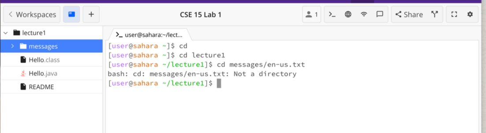
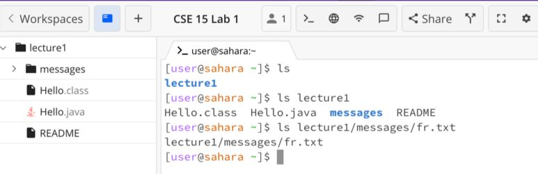
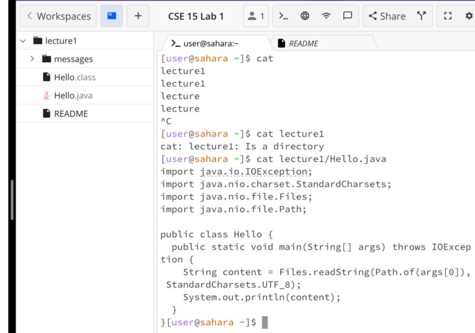

# CSE 15 L Week 1 Lab Report 

**1. cd Command**

* Example with no arguments can be seen in the first command line. The working directory when the command was running was home directory. The output can be interpreted as the directory getting changed back to the home directory since we have provided no commands. No error is observed in output.
  
* Example with path to directory can be seen in the second command line. The working directory now gets changed from home to 'lecture 1'after the command runs. The output that we have observed from this is that the directory gets changed and now becomes 'lecture 1'. No error is observed in output.

* Example with path to file can be seen in the third command line. There is no change in the working directory now and it is 'lecture 1' only because we had changed that in the previous commnad. The output can hece be seen as an an error because with cd command we need a directory only to change the directory from one to another but the change from a directory to a file is not possible which can also be seen in the output.

**2. ls Command**

* Example with no arguments can be seen in the first command line. The working directory when the command was running was home directory. The output shows that 'lecture 1' is present inside the home directory and hence it shows 'lecture 1' as the output. No error is observed in output.
  
* Example with path to directory can be seen in the second command line. The working directory the command was running was home directory. The output that we have observed is that all the files inside the 'lecture 1' directoy are being listed 'Hello.class','Hello.java','messages' and README. No error is observed in output.

* Example with path to file can be seen in the third command line. The working directory the command was running was home directory. The output is the path that we have put in as the input only because inside the file there is no sub file present except the file that we had passed in the input hence it just displays that. No error is observed in output.

**2. cat Command**

* Example with no arguments can be seen in the first command line. The working directory when the command was running was home directory. Since there was no input given the cat command took an empty string as the input and then if we go to the next line and type something then it concatenates it with the empty string only and returns it back. Hence, we can only escpae it by doing command+C. This error can be observed in the output.
  
* Example with path to directory can be seen in the second command line. The working directory the command was running was home directory. The argument that we have passed is a directory and the cat command only prints the contents of the file and hence it is mentioned in the output also the lecture 1 is a directory and hence it cannot be printed.

* Example with path to file can be seen in the third command line. The working directory the command was running was home directory. The output is printing all the contents of the file Hello.java. No error is observed in output.

