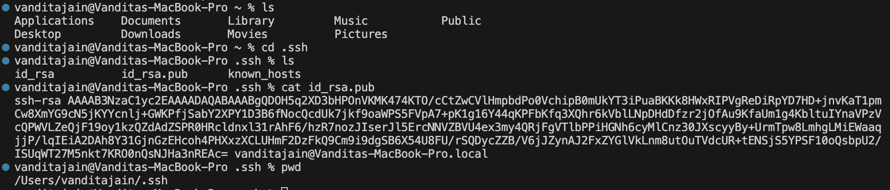
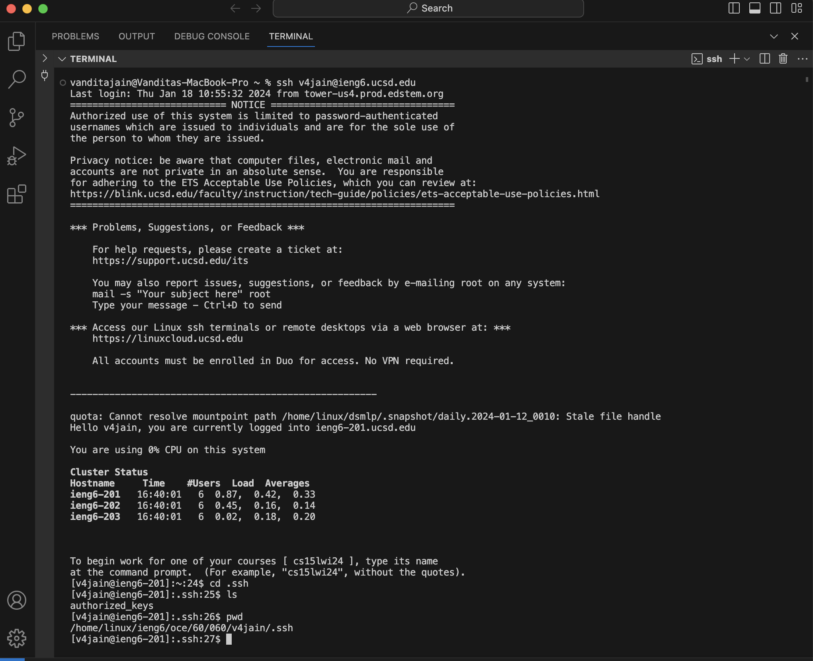

# CSE 15 L WEEK 2 LAB REPORT 

## PART 1 

* Code for the ```ChatServer```

```

import java.io.IOException;
import java.net.URI;


class Handler implements URLHandler {

   String displayMssg="";
    
    public String handleRequest(URI url) {
        if (url.getPath().equals("/")) {
            return "Start adding your Strings";
        }
        else{
            if (url.getPath().contains("/add")) {
                String[] parameters = url.getQuery().split("=");
                if (parameters[0].equals("s")) {
                    String[] subParameter=(parameters[1]).split("&");
                    displayMssg+=parameters[2]+": "+ subParameter[0]+"\n";
                    return displayMssg;
                    
                    }
                
                }
            return "404 Not Found";
        
        }
    }
        
}

class ChatServer {
    public static void main(String[] args) throws IOException {
        if(args.length == 0){
            System.out.println("Missing port number! Try any number between 1024 to 49151");
            return;
        }

        int port = Integer.parseInt(args[0]);

        Server.start(port, new Handler());
    }
}

```
* Screenshots of using the ```/add-message```
  
* *Screenshot 1:*
 
1. The method in our code which are being called are ```handleRequest``` and the ```main``` method.
2. The argument for the ```handleRequest``` is ``` URI url``` which is the the URL of the Server we have created. The specific fields which it uses is the ```displayMssg``` field which stores the final String to be displayed which has a current value of an empty string, ```parameters``` is a String array which is used to store the different parts of the query that we have passed in and ```subParameter``` is another String array which further stores the sub components of the query that are required to display the valid message. They both have current values as null. The argument for the ```main``` method is ```args``` which is a String array and it is used to store the value of the port number entered by the user  .
3.  When we have passed this special request the the value of ``` URI url``` is [https://0-0-0-0-4000-3luhckvmqqqjfa22l52no227s4.us.edusercontent.com/add-message?s=Love%20CSE15%20L&user=Vandita](https://0-0-0-0-4000-3luhckvmqqqjfa22l52no227s4.us.edusercontent.com/add-message?s=Love%20CSE15%20L&user=Vandita) and the value of ```parameters``` becomes an array of
```["s","Love CSE 15 L&user","Vandita"]``` whereas the value of ```subParameter``` now becomes an array of ```["Love CSE 15 L","&","user"]``` and finally the value of the ```displayMssg``` field becomes the String ```Vandita: Love CSE 15 L \n``` which is what being displayed. For the ```main``` method the value of ```args``` becomes ```["1"]```.
    
* *Screenshot 2:*

1. The method in our code which are being called are ```handleRequest``` the ```main``` method is only called the first time to start the server.
2. The argument for the ```handleRequest``` is ``` URI url``` which is the the URL of the Server we have created. The specific fields which it uses is the ```displayMssg``` field which stores the final String to be displayed which has a current value of a String ```Vandita: Love CSE 15 L \n``` , ```parameters``` is a String array which is used to store the different parts of the query that we have passed in and ```subParameter``` is another String array which further stores the sub components of the query that are required to display the valid message. They both have current values as null.
3. When we have passed this special request the the value of ``` URI url``` is [https://0-0-0-0-4000-3luhckvmqqqjfa22l52no227s4.us.edusercontent.com/add-message?s=Bonjour&user=Shreya](https://0-0-0-0-4000-3luhckvmqqqjfa22l52no227s4.us.edusercontent.com/add-message?s=Bonjour&user=Shreya) and the the value of ```parameters``` becomes an array of ```["s","Bonjour&user","Shreya"]``` whereas the value of ```subParameter``` now becomes an array of ```["Bonjour","&","Shreya"]``` and finally the value of the ```displayMssg``` field becomes the String ```Vandita: Love CSE 15 L\n Shreya: Bonjour\n``` which is what being displayed.

## PART 2
1. *Private Key Absolute Path:```/Users/vanditajain/.ssh/id_rsa.pub```*
   
2. *Public Key Absolute Path:```/home/linux/ieng6/oce/60/060/v4jain/.ssh/authorized_keys```*
   
3. We can see in the Screenshot above that I was not asked for my password and it automatically logged me in.
## PART 3
I learnt how to operate Servers as well as passing in query so that we can change what is being displayed and perform multiple actions in Week 2 . I was also fascinated by how we used the ```mkdir``` and ```ssh``` commands in Week 3 which actually enabled me to store my password. It was really unique to see that the terminal can only implement this and I didn't have to write much of java code too.
