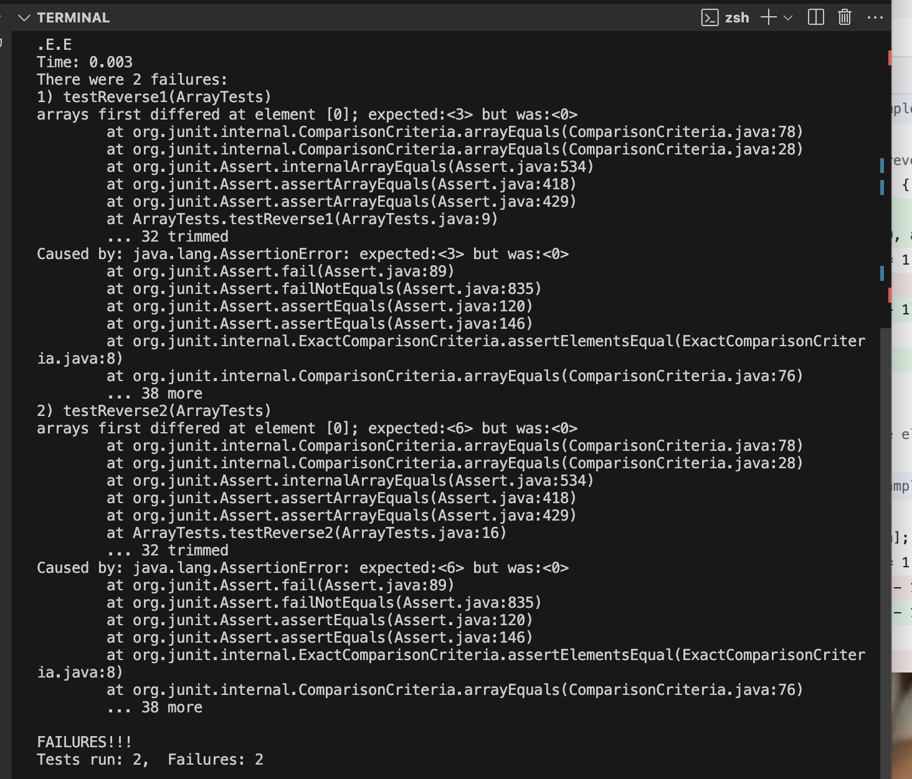

# CSE 15 L WEEK 3 LAB REPORT 

## PART 1 

## Bug:- Method ``` static int[] reversed(int[] arr) ```

* Failure-inducing input
  
  ```
   @Test
  public void testReversed1() {
    int[] input1 = {4,5,6};
    assertArrayEquals(new int[]{6,5,4}, ArrayExamples.reversed(input1));
  } 
```

* Non failure-inducing input

```
@Test 
public void testReversed2() {
    int[] input1 = { 3 };
    assertArrayEquals(new int[]{ 3 }, ArrayExamples.reversed(input1));
}
 ```
* The symptom

* Bug before:- The bug arises in the line ``` arr[i] = newArray[arr.length - i - 1]; ``` because we are changing the values of the original array due to which we are not being able to correctly extract the value present at previous indexes.
```
static int[] reversed(int[] arr) {
    int[] newArray = new int[arr.length];
    for(int i = 0; i < arr.length; i += 1) {
      arr[i] = newArray[arr.length - i - 1];
    }
    return arr;
    
  }
```

* Ammended code:- I have fixed the bug by replacing the line with the bug by ``` newArray[i] = arr[arr.length - i - 1]; ``` line as well as returning the new array. Through this I am able to correctly extract the value at previous indexes and assign them to the correct indexes of the new array.
```
static int[] reversed(int[] arr) {
    int[] newArray = new int[arr.length];
    for(int i = 0; i < arr.length; i += 1) {
      newArray[i] = arr[arr.length - i - 1];
    }
    return newArray;
  }
```

## PART 2
## Command:- ``` find ```


