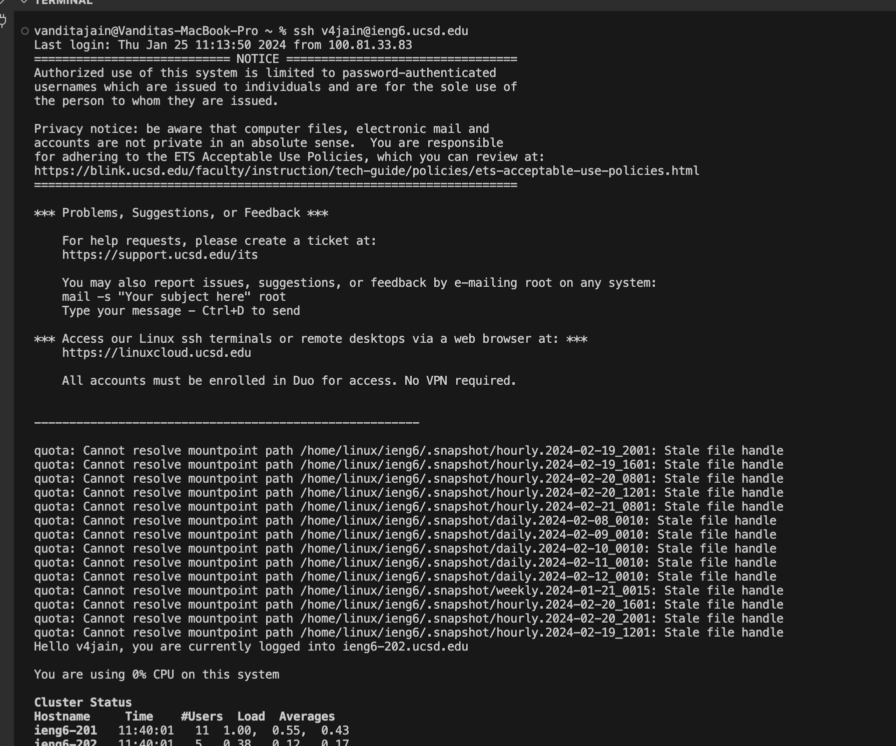
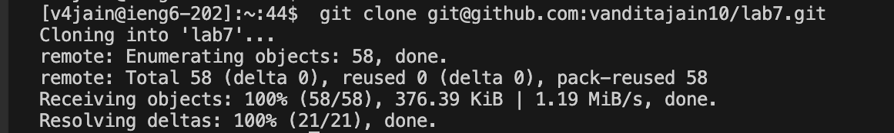
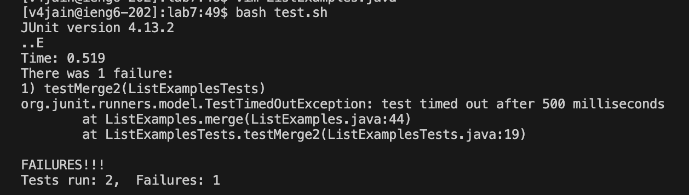
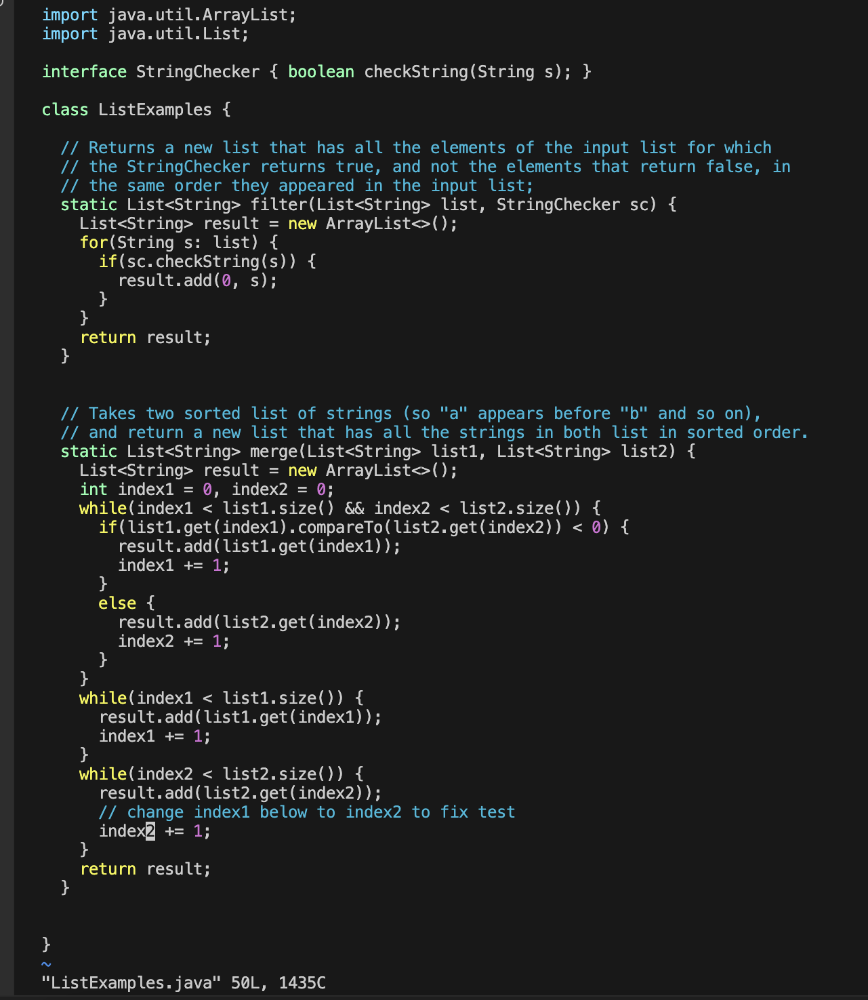
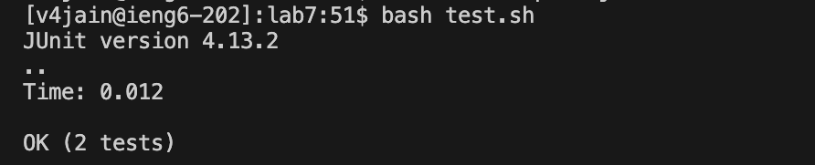
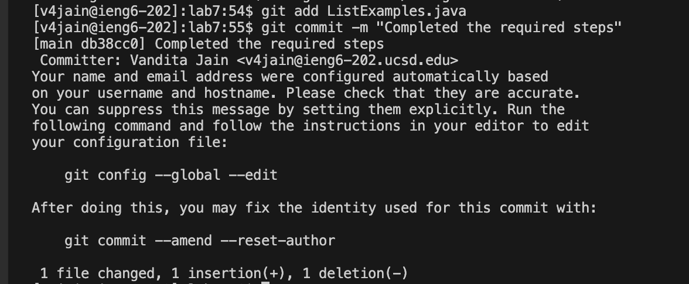
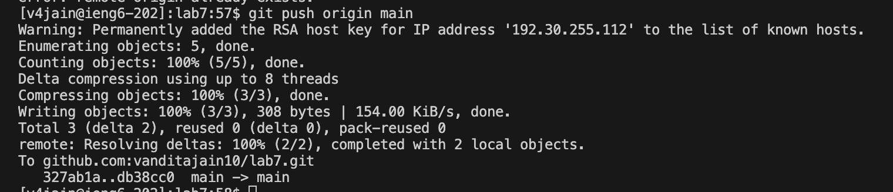

# CSE 15 L WEEK 4 LAB REPORT 

## STEP 4

For logging into my ieng6 account I typed in the command 
``` ssh v4jain@ieng6.ucsd.edu ``` and then pressed the key ```<enter>``` . This press indicated the terminal to execute the command typed and then it allows me to log in into my account. 




## STEP 5

After this , I typed in the command ``` git clone git@github.com:vanditajain10/lab7.git ``` and in order to paste the ssh path from the github page to the terminal, I pressed the key ``` Command + V ``` followed by pressing the ```<enter>``` key which allowed the terminal to execute the command. This command allowed me to clone my repository 



## STEP 6

I then typed the command ``` bash test.sh ``` followed by pressing the ```<enter>``` key which allowed the terminal to execute the command.This command allowed me to run the tests, demonstrating that they fail in the output found below it. 



## STEP 7

I typed in the command ``` vim listExamples.java ``` and pressed the ```<enter>``` key which allowed the terminal to execute the command so that I can open the ``` listExamples.java ``` and edit it through vim in the terminal. In order to fix the error. 
* I pressed ```<j><j><j><j><j><j><j><j><j><j><j><j><j><j><j><j><j><j><j><j><j><j><j><j><j><j><j><j><j><j><j><j><j><j><j><j><j><j><j><j><j><j><j><j> ``` in total of 44 times in order to move the cursor down
* I pressed ```<l><l><l><l><l><l><l><l><l><l><l>``` in total of 11 times so that the cursor goes right.
* I pressed ``` <x> ``` in order to delete the '1' character.
* I pressed ``` <i> ``` so that the insert mode is activated.
* I pressed ``` <2> ``` in order to add the '2' character after index word.
* I pressed ``` <esc> ``` to go back to the normal more.
* Finally I pressed ``` <:w+q+!> ``` in order to save and exit.




## STEP 8

I then again run the command ``` bash test.sh ``` by pressing the ``` <arrow+up> ``` key once to find the command from my history and then pressed the ```<enter>``` key which allowed the terminal to execute the command. This ran the tests and indicated that the test ran successfully without an error.



## STEP 9

Then I ran the command ``` git add ListExamples.java ``` followed by pressing the ```<enter>``` key which allowed the terminal to execute the command in order to add the ammended file. I then ran the command ``` git commit -m "Completed the required steps" ``` followed by pressing the ```<enter>``` key which allowed the terminal to execute the command which allowed me to commit my changes. I finally ran the command ``` git push origin main ```  followed by pressing the ```<enter>``` key which allowed the terminal to execute the command which allowed me to push all of my local commits in the main branch of the forked reposity.





