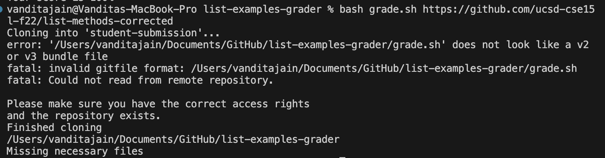
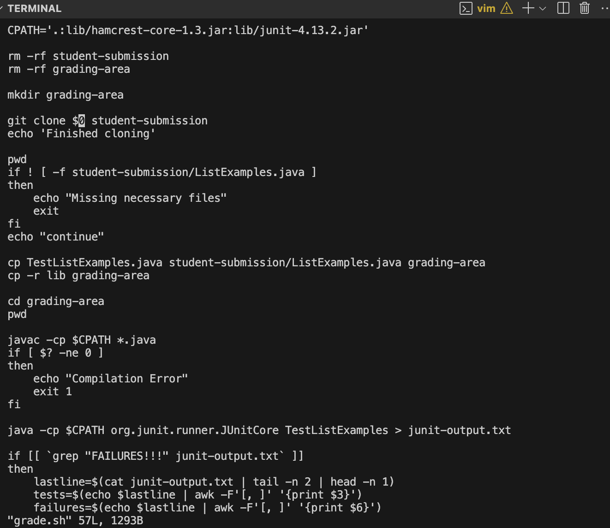
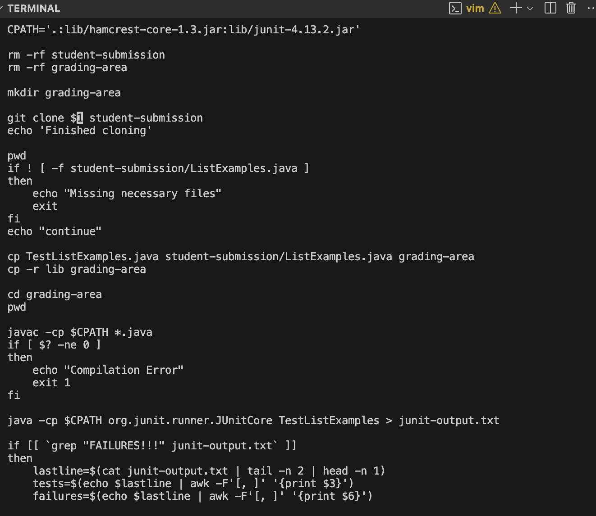
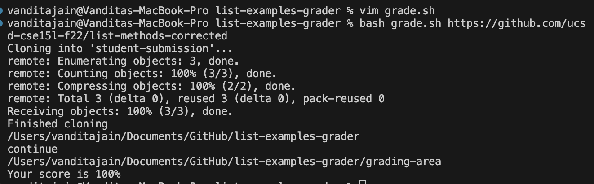

# CSE 15 L WEEK 3 LAB REPORT 

## PART 1 

## Student:- 

When, I am trying to run my bash script with ``` bash grade.sh ``` with the link https://github.com/ucsd-cse15l-f22/list-methods-corrected, it is giving me an error, it is saying could not read from the repository but it then says finished cloning and followed by Missing necessary files. I think there is some problem in cloning the file correctly.



## TA:- 
Try to see if you have used the correct number with your $ sign to get the correct argument from bash because your path is ``` /Users/vanditajain/Documents/GitHub/list-examples-grader/grade.sh ``` which is incorrect . Try looking at the line where you are cloning your repository and using the dollar sign using bash script ``` vim grade.sh ``` and then try running it again.

## Student:- 
Oh! I realised that I had used $0 instead of $1 after ``` git clone ``` due to which it was getting the current file name instead of the first argument to bash which was getting cloned and then since it did not have the necessary files it displayed the Missing necessary files resulting to an exit.




## TA:-

