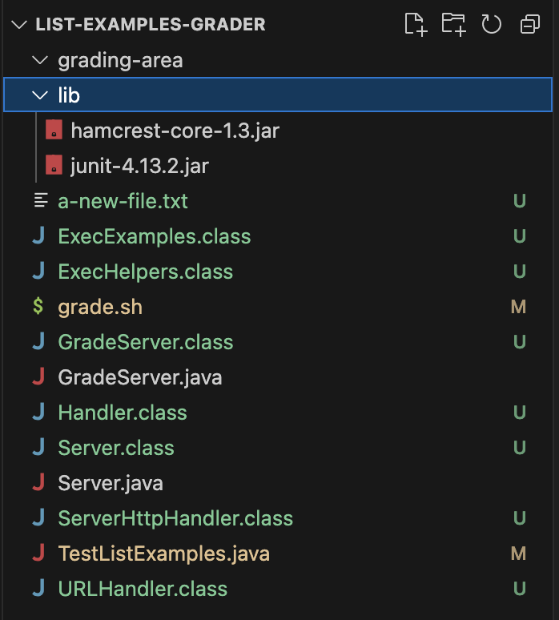

# CSE 15 L WEEK 3 LAB REPORT 

## PART 1 

## Student:- 

When, I am trying to run my bash script with ``` bash grade.sh ``` with the link [Link](https://github.com/ucsd-cse15l-f22/list-methods-corrected), it is giving me an error, it is saying could not read from the repository but it then says finished cloning and followed by Missing necessary files. I think there is some problem in cloning the file correctly.


## TA:- 
Try to see if you have used the correct number with your $ sign to get the correct argument from bash because your path is ``` /Users/vanditajain/Documents/GitHub/list-examples-grader/grade.sh ``` which is incorrect . Try looking at the line where you are cloning your repository and using the dollar sign using bash script ``` vim grade.sh ``` and then try running it again.

## Student:- 
Oh! I realised that I had used $0 instead of $1 after ``` git clone ``` due to which it was getting the current file name instead of the first argument to bash which was getting cloned and then since it did not have the necessary files it displayed the Missing necessary files resulting to an exit.


## The structure need 
* The file & directory structure needed -->
* 
* 
* The contents of each file before fixing the bug -->
* ## BEFORE IN THE BASH SCRIPT grade.sh
  
```
CPATH='.:lib/hamcrest-core-1.3.jar:lib/junit-4.13.2.jar'

rm -rf student-submission
rm -rf grading-area

mkdir grading-area

git clone $0 student-submission
echo 'Finished cloning'

pwd
if ! [ -f student-submission/ListExamples.java ]
then 
    echo "Missing necessary files"
    exit 
fi
echo "continue"

cp TestListExamples.java student-submission/ListExamples.java grading-area 
cp -r lib grading-area

cd grading-area
pwd

javac -cp $CPATH *.java 
if [ $? -ne 0 ]
then 
    echo "Compilation Error"
    exit 1
fi

java -cp $CPATH org.junit.runner.JUnitCore TestListExamples > junit-output.txt

if [[ `grep "FAILURES!!!" junit-output.txt` ]]
then 
    lastline=$(cat junit-output.txt | tail -n 2 | head -n 1)
    tests=$(echo $lastline | awk -F'[, ]' '{print $3}')
    failures=$(echo $lastline | awk -F'[, ]' '{print $6}')
    successes=$((tests - failures))
    echo "Your score is $successes / $tests"

elif [[ `grep "OK" junit-output.txt` ]]
then
    lastline=$(cat junit-output.txt | tail -n 2 | head -n 1)
    tests=$(echo $lastline | awk -F'[, ]' '{print $4}')
    echo "Your score is 100%"

fi
```

* ## AFTER IN THE BASH SCRIPT grade.sh

```
CPATH='.:lib/hamcrest-core-1.3.jar:lib/junit-4.13.2.jar'

rm -rf student-submission
rm -rf grading-area

mkdir grading-area

git clone $1 student-submission
echo 'Finished cloning'

pwd
if ! [ -f student-submission/ListExamples.java ]
then 
    echo "Missing necessary files"
    exit 
fi
echo "continue"

cp TestListExamples.java student-submission/ListExamples.java grading-area 
cp -r lib grading-area

cd grading-area
pwd

javac -cp $CPATH *.java 
if [ $? -ne 0 ]
then 
    echo "Compilation Error"
    exit 1
fi

java -cp $CPATH org.junit.runner.JUnitCore TestListExamples > junit-output.txt

if [[ `grep "FAILURES!!!" junit-output.txt` ]]
then 
    lastline=$(cat junit-output.txt | tail -n 2 | head -n 1)
    tests=$(echo $lastline | awk -F'[, ]' '{print $3}')
    failures=$(echo $lastline | awk -F'[, ]' '{print $6}')
    successes=$((tests - failures))
    echo "Your score is $successes / $tests"

elif [[ `grep "OK" junit-output.txt` ]]
then
    lastline=$(cat junit-output.txt | tail -n 2 | head -n 1)
    tests=$(echo $lastline | awk -F'[, ]' '{print $4}')
    echo "Your score is 100%"

fi
```
* The full command line (or lines) you ran to trigger the bug --> ```  bash grade.sh https://github.com/ucsd-cse15l-f22/list-methods-corrected ```
* A description of what to edit to fix the bug --> ``` vim grade.sh ``` then go to the line ``` git clone $0 student-submission ``` then delete 0 by pressing ```<x>``` and then change to insert mode by pressing ```<i>``` and add to make it ``` git clone $1 student-submission ``` then type ```: + <w>+  <q>+  !``` then again run the command.

## PART 2
Something really fun I learnt in lab and lecture last week was jdb . I didnt know that java had its own debugger. I was suprised that how different it was from bash and that in some cases it is better to use bash than jdb like when we use * to search with file names. I also didnt know about vim and that how we could just edit and view files in the terminal.
